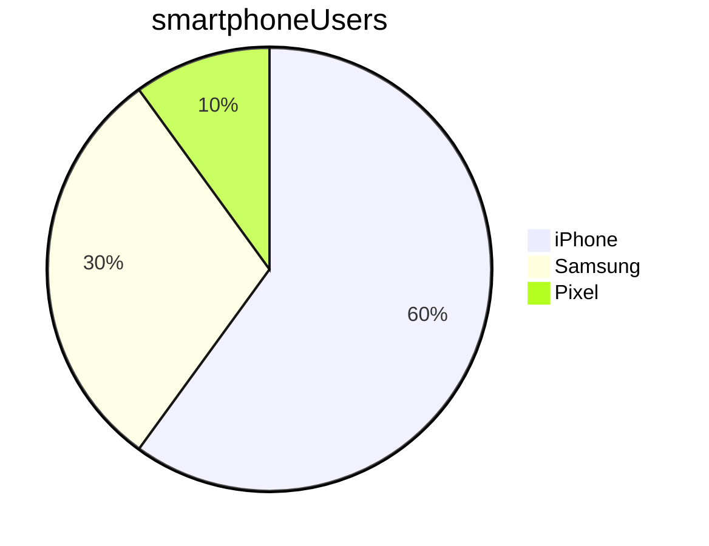

# Learn markdown

## Markdown basics

### Subheadings

Use hashes

### Marking code

This is how you print something to the screen in Python: `print("Hello")`

This is how you show a code block:

```python
print("Hello")
print("My name is Sherin")
```

### Showing a special note

> Note: This is a great way to make a note stand out

### Lists

* bullet point 1
  * sub point 1
  * sub point 2
* bullet point 2


1. item 1
   1. sub item 1
   2. sub item 2
2. item 2

<br>

1. Step 1
   * point to do with step 1
   * next point to do with step 1
2. Step 2

> Note: 
> 
> If sequence is important, use numbered steps. Otherwise, use bullet points.


### Checklist

- [ ] Apples
- [x] Bread
- [x] Pet food

### Highlighting text

This is how to do **bold**

_This is how to do italics_


### Images


### Links

Click here to go to [Google](https://www.google.com)


## Extra markdown

### Tables

| Name  | Street      | Town       |
|-------|-------------|------------|
| Cathy | Main St     | Birmingham |
| John  | Maple Drive | Stafford   |


### Mermaid for charts




### Comment out something

[//]: # (Comment this text out)

