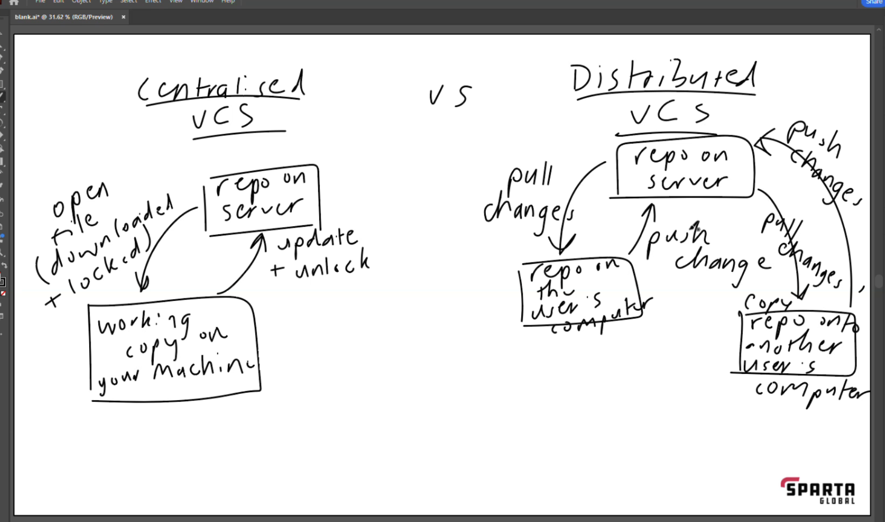
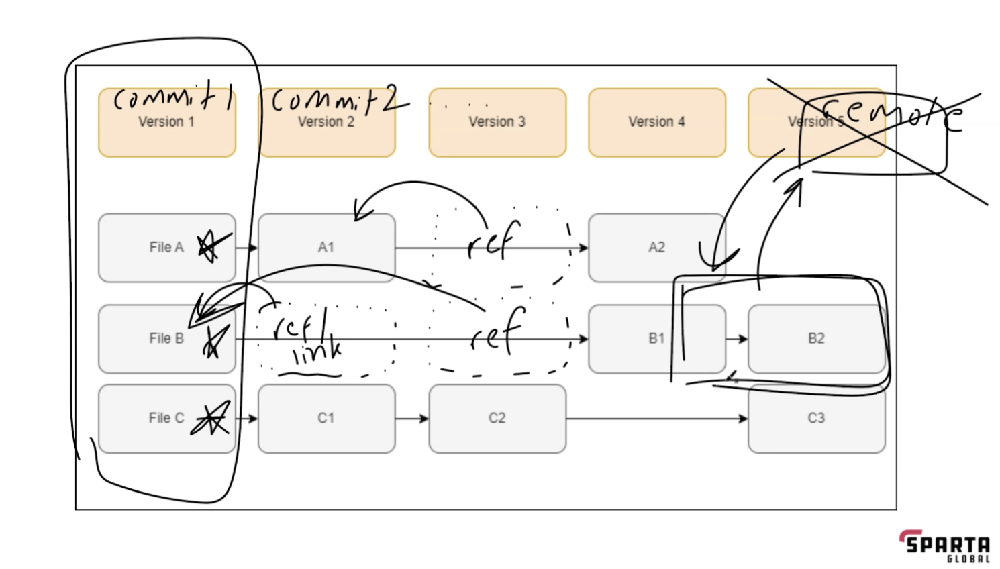
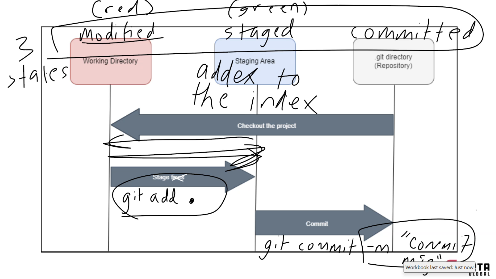

# Intro to Version Control and Git

## Version Control System

### What is a Version Control System (VCS)

* A system that helps you track/manage/save/record changes to a file or set of file over time, so that we can recall a specific version later

### Benefits

* Revert changes for a file or all the file back to specific version
* Compare changes over time
* See who made changes and when
* Able to accept changes

### Types of version control

#### What is manual version control

* Such as when you make a copy of a file or folder of files with a name like v1.1, v1.2

#### How did early version control systems work

* Tracked changes to individual files
* Base file to start, then each version saved a delta
* To get the latest version, had to use base file + all deltas

#### Centralised VCS vs Distributed VCS like Git

> See Diagram
> 
> 

## Local Version Control with Git

### What is stored in each version of a file that changes

* store the snapshot of the whole file that can be changed

### What does Git store in a 'commit'

> See Diagram
> 

### Does Git need to be used as a distributed VCS

* No, but better to be distributed to get benefits such as having backup copy, sharing with others, collaborating on the same set of files as a team

### The three states in Git

> See Diagram
> 
> 

### Where does Git store its information

* .git

### Common workflow of Git commands

* Turn a normal folder into  a Git repo: `git init`
* To save changes to the set of files in the Git repo:
  1. Stage all the files in the folder: `git add .`
  2. Commit the changes: `git commit -m "appropriate commit message"`